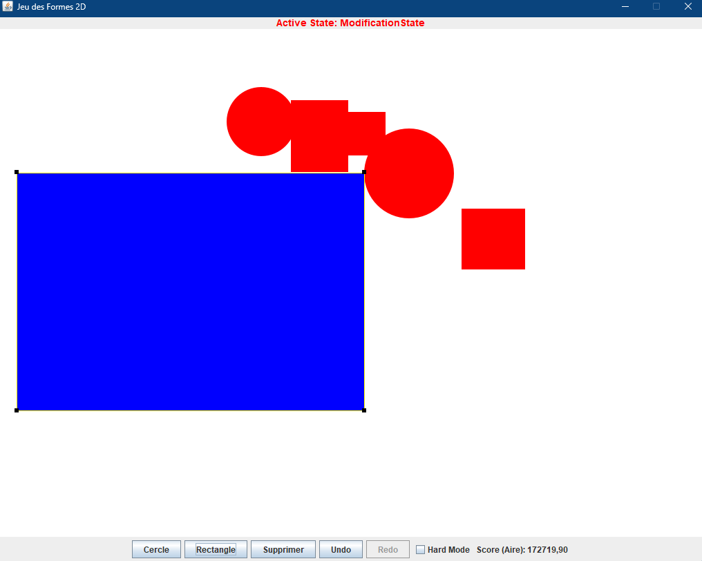
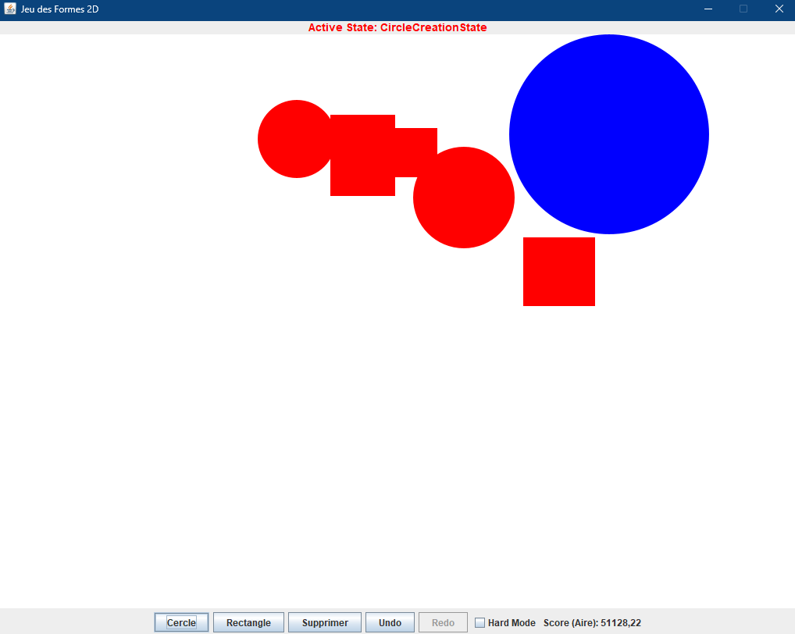
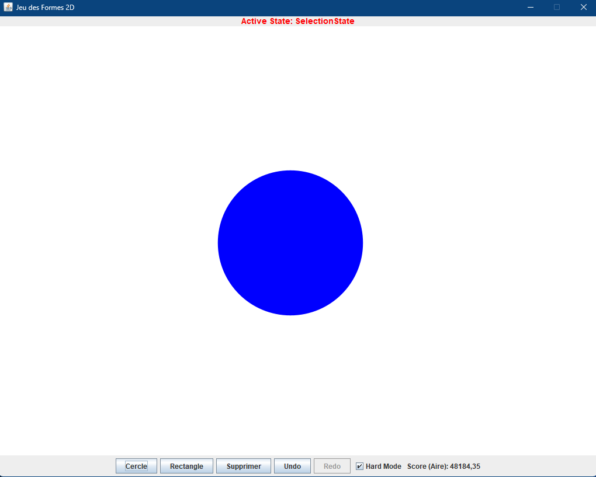

# Rapport de Conception Logicielle : Jeu des Formes 2D

## 1. Introduction
Ce document présente l'architecture logicielle et les choix de conception réalisés pour l'implémentation du "Jeu des Formes 2D". L'objectif de ce projet était de construire une application interactive dotée d'une interface graphique (GUI) robuste, permettant la manipulation de formes géométriques, tout en respectant les bonnes pratiques de la Programmation Orientée Objet (POO).

## 2. Architecture Globale : Modèle-Vue-Contrôleur (MVC)
Pour garantir une forte modularité et une séparation claire des responsabilités, l'application est structurée selon le patron architectural **MVC**.

### 2.1 Le Modèle (`game.model`)
Le modèle encapsule l'état entier de l'application et la logique métier indépendamment de l'interface graphique.
- **`GameModel`** : Gère la liste des formes rouges (obstacles), la liste des formes bleues (formes du joueur), le score global (l'aire couverte), et l'activation du mode Difficile.
- **Interfaces et Héritage des Formes** : L'interface `IShape` définit les capacités de chaque forme (dessin, calcul d'aire, translation, mise à l'échelle, détection de collisions). La classe abstraite `ShapeBase` factorise les attributs communs (couleur, état de sélection). Les classes concrètes (`Circle`, `RectangleShape`) implémentent la logique géométrique spécifique.
- **Observateur (Observer Pattern)** : Le pattern `Observer` est omniprésent à deux niveaux :
    1. **Global** : Via l'interface `ModelListener`, le `GameModel` notifie les vues (`GamePanel`, `ControlPanel`) de tout changement majeur (ajout/suppression).
    2. **Granulaire** : Chaque forme (`IShape`) notifie ses propres écouteurs via `ShapeListener`. Le `GameModel` écoute ainsi chaque forme individuelle pour relayer les notifications de modification (déplacement, redimensionnement) à la vue, créant un système réactif fluide.

### 2.2 La Vue (`game.view`)
La vue est uniquement responsable de l'affichage des données fournies par le Modèle.
- **`GamePanel`** : Étend `JPanel` et joue le rôle de la zone de dessin. Elle s'inscrit comme `ModelListener` auprès de `GameModel` et se redessine (via `repaint()`) à chaque notification.
- **`ControlPanel`** : Fournit l'interface utilisateur pour la sélection d'outils (boutons Créer Cercle/Rectangle, Supprimer, Undo, Redo, case à cocher pour le Mode Difficile).
- **`MainFrame`** : Assemble les différents panneaux dans une grille logique.

### 2.3 Le Contrôleur (`game.controller`)
Le contrôleur fait le pont entre les interactions de l'utilisateur (Vue) et les modifications d'état (Modèle).
- **`MouseController`** : Intercepte les événements de la souris (clics, glisser-déposer). Le glisser-déposer interactif (drag-and-drop) permet notamment de créer visuellement et dynamiquement les formes avec leur taille exacte (avec pixel-stepping d'interpolation), ainsi que de les redimensionner à la perfection.

## 3. Gestion des Interactions : Le Patron State
Afin d'éviter des conditions multiples (`if/else`) complexes dans le contrôleur (ex: `isCreating`, `isDragging`), le **State Pattern** a été implémenté.
- **`ControllerState`** : Interface mère définissant le comportement attendu pour chaque événement de la souris (`mousePressed`, `mouseDragged`, `mouseReleased`).
- **États Concrets** : `SelectionState`, `CircleCreationState`, `RectangleCreationState`, `SuppressionState`, et l'état composite `ModificationState`. Ce dernier délègue les opérations spécifiques à ses sous-états spécialisés : `MoveState`, `ResizeState` et `ScaleState`.
- **Avantage** : Chaque interaction est encapsulée de façon modulaire, permettant un code clair et hautement extensible.
- **Observation** : Le contrôleur expose l'état actif actuel à la l'interface graphique en temps réel via l'utilisation d'une lambda de rappel, améliorant l'Expérience Utilisateur.

## 4. Implémentation du Undo/Redo : Le Patron Command
Le besoin d'annuler et de rétablir les actions de l'utilisateur (création, déplacement, redimensionnement, suppression) nécessite la mémorisation de l'historique de jeu. Pour cela, le design pattern **Command** est utilisé.

- **Interface `Command`** : Définit deux méthodes cruciales : `execute()` et `undo()`.
- **Commandes Concrètes** : `CreateShapeCommand`, `MoveShapeCommand`, `ResizeShapeCommand`, et `DeleteShapeCommand`. Chaque classe mémorise l'état nécessaire à l'inversion de l'action (par exemple, le delta de déplacement ou le facteur d'échelle centre-dépendant), ce qui remplit le rôle d'un **Memento** léger sans nécessiter de classes de snapshot complexes.
- **`CommandManager`** : Agit comme l'**Invoker**. Il maintient deux piles (`Stack<Command>`) : `undoStack` et `redoStack`. Lorsqu'une commande est exécutée, elle est placée dans `undoStack`, et `redoStack` est vidée. L'action `Undo` dépile de `undoStack`, appelle la méthode `undo()` de la commande, et la place dans `redoStack`.

## 5. Centralisation de la Création : Patterns Factory et Singleton
Pour instancier les formes géométriques de manière évolutive sans coupler les classes clientes (les états de création) aux implémentations concrètes (`Circle`, `RectangleShape`) :
- **`ShapeFactory`** : Située dans le package `game.shapes`, cette fabrique est responsable de la création de tous les objets `IShape`. Si de nouvelles formes (ex: Triangle) sont ajoutées, seule la fabrique sera modifiée, minimisant la dispersion logique.
- **Singleton** : `ShapeFactory` est instanciée via un objet unique (Singleton), évitant la duplication de la fabrique en mémoire et offrant un point d'accès global contrôlé.

## 6. Règles Métier : Le Patron Strategy
Les règles dictant si une forme peut être posée ou déplacée (collisions, gestion des limites spatiales 1024x735 de l'écran, prise en compte du *Hard Mode*) sont extraites dans le patron **Strategy**.
- **`IPlacementStrategy`** : Définit les contrats de validation de mouvement et d'instanciation.
- **`StandardPlacementStrategy`** : Valide la création de base (limites du `GamePanel` et collisions directes).
- **`HardModePlacementStrategy`** : Ajoute des règles strictes complémentaires et délègue au mode classique si rien n'empêche le coup. La gestion est asynchrone et empêche l'ajout lors du chronomètre.

## 7. Gestion des Collisions, "Hard Mode" et Calcul d'Aire
### 7.1 Détections Géométriques
Afin de valider les contraintes du jeu (les formes bleues ne doivent pas s'intersecter avec les formes rouges ou sortir du cadre), l'API Java 2D (`java.awt.geom.Area`) est utilisée. La méthode booléenne `Area.intersect` garantit une détection fine et précise pixel par pixel, quel que soit le type des deux formes impliquées.
Le "Hard Mode" est géré en injectant un "Timer" asynchrone qui cache les éléments rouges au bout de 10 secondes.

### 7.2 L'algorithme de Calcul d'Aire (Formule des Lacets)
L'objectif central du jeu est de recouvrir le maximum d'espace. L'aire des formes bleues, et implicitement le score, est rigoureusement calculée aux polygones près :
1. L'application fusionne mathématiquement le périmètre des entités (`Area.add()`) si désiré afin d'éviter de compter l'aire deux fois si les formes devaient se chevaucher.
2. Extraite de la géométrie pure, l'aire absolue est déterminée mathématiquement en décortiquant le contour de la forme via un `PathIterator`.
3. L'algorithme applique le **Théorème de Green** (particulièrement sa variante discrète, la **Shoelace Formula** ou formule des lacets). En itérant sur chaque point de jonction (`SEG_LINETO`) du contour 2D via un `PathIterator`, l'algorithme cumule les produits croisés vectoriels `(x_i * y_{i+1} - x_{i+1} * y_i)`. Cette approche permet de déduire l'aire au flottant près avec une complexité temporelle de `O(N)`.

# 8. Répartition du travail

Kevin Orhan : Création des codes relatifs aux commandes utilisateurs 
Hicham Siad : Création des codes relatifs à l'interface graphique et des models.
Clément Bolifraud : Création des codes relatifs aux formes et controllers ainsi que la mise en relation des différents patrons. 

## 9. Annexes (Captures d'écran)

Modification de forme

Création de forme

Suppression de forme
